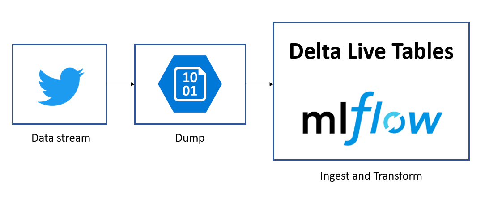
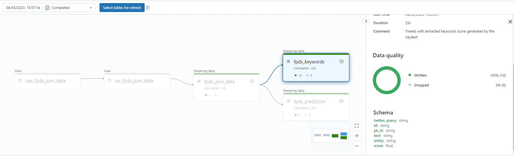
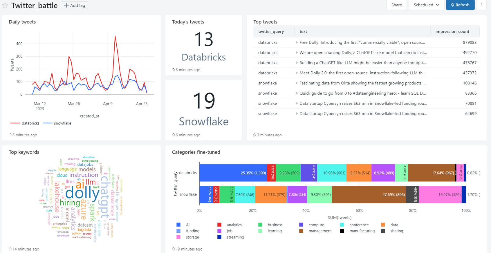

# SQLDay2023

This repository contains code for a demo that we conducted on SQLDay 2023 during presentation _Databricks Delta Live Tables i MLflow w akcji - czyli ELT z ML w trybie "near to real time"_, which describes how we combined DLT with Machine Learning. 

## Context

Together with a rapid growth of digitalization, we obtain more and more data with higher velocity. In this context, effective ELT/ETL processes are key while building solutions, no matter if we are building a classic data warehouse, data lake or the increasingly popular data lakehouse. It is also important to ensure the reliability and manageability of machine learning models in such a dynamic environment. During the session we show how we built an analytical solution processing stream data, using Databricks Workflow, Delta Live Tables and MLflow.

## Data

We decided to measure popularity of the two competing technologies databricks and snowflake, based on the social media discourse on twitter platform. The approach was to get tweets via twitter API with python notebook executed in a continuous mode workflow, dump the data to blob storage in a raw format and then transform them with the use of Delta Live Tables.

## Delta Live Tables

The Delta Live Tables are used together with Datbricks Auto Loader, which ingests the dump data into lakehouse and detects the schema. Then we apply on the data several Machine Learning models, registered as SQL functions to derive any meaningful information from the tweets. 

## Models

In this demo we use three models, two of them are classifiers and one is a keywords extractor. For classification we used pretrained [tweet-topic-21-multi](https://huggingface.co/cardiffnlp/tweet-topic-21-multi) model from Hugging Face, a fine-tuned ada model trained on openai API with a use of ~250 examples labelled by us into 11 categories and a [KeyBERT](https://maartengr.github.io/KeyBERT/) keyword extraction technique. All models were registered in mlflow for easier management.

## Dashboard

At the end we constructed a [redash](https://www.databricks.com/blog/2020/06/24/welcoming-redash-to-databricks.html) dashboard which graphically summarizes our insights.

